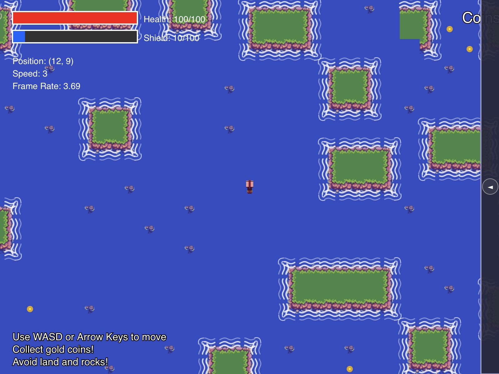

# Pirates of the Caribbean

A procedurally generated ocean adventure game where you navigate treacherous seas as a pirate captain!

## Game Overview

Pirates of the Caribbean is a 2D top-down sailing adventure game featuring procedurally generated ocean maps. Navigate your ship through an endless ocean filled with islands, rocks, and valuable treasure coins. Manage your health and shield while exploring the ever-expanding world.

## Features

- **Procedural Ocean Generation**: Using Wave Function Collapse algorithm to create unlimited, seamless ocean maps
- **Dynamic World Loading**: The world generates new sections as you explore
- **Realistic Water Effects**: Beautiful wave animations around islands
- **Ship Navigation**: Smooth sailing controls with 16 directional sprites
- **Health & Shield System**: Manage your resources to survive longer
- **Damage Effects**: Visual feedback with screen shake and red tint when taking damage
- **Treasure Collection**: Gather coins scattered across the ocean
- **Shop System**: Purchase upgrades and items with collected coins
- **Minimap**: Track your position in the vast ocean

## How to Play

### Controls

- **Movement**: Use WASD or Arrow Keys to navigate your ship
- **Shop**: Click the arrow on the right side of the screen to expand/collapse the shop
- **Restart**: Press any key after game over to restart

### Gameplay Tips

1. **Watch Your Health**: Your health slowly decreases over time, so collect coins to buy health potions
2. **Avoid Land & Rocks**: Land collisions deal 10 damage, while rocks deal 2 damage
3. **Use Your Shield**: Your shield blocks overflow damage when depleted
4. **Speed Management**: Faster speed lets you explore more but makes navigation trickier
5. **Shop Wisely**: Spend your coins strategically on health, shields, or speed boosts

### Game States

- **Start Screen**: Shows game instructions
- **Playing**: Explore the ocean, collect coins, and survive
- **Game Over**: View your final score and restart

## Technical Details

This game is built using p5.js and features:

- Wave Function Collapse algorithm for procedural content generation
- Sine wave animations for water effects
- Object-oriented design for game entities
- Camera system with dynamic loading
- Collision detection with circle-rectangle algorithms
- Visual damage feedback system

## Getting Started

1. Clone this repository
2. Open `index.html` in a modern web browser
3. No additional dependencies or setup required!

## Credits

Created as part of Creative Embedded Programming (CEP) Assignment 4.

Sprites and game assets based on public domain resources.
